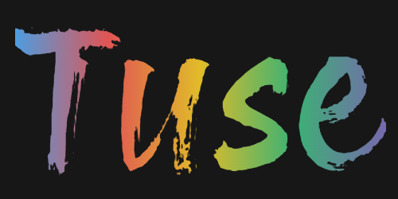

<a id="readme-top"></a>

<!-- PROJECT SHIELDS -->

[![Contributors][contributors-shield]][contributors-url]
[![Forks][forks-shield]][forks-url]
[![Stargazers][stars-shield]][stars-url]
[![Issues][issues-shield]][issues-url]

<!-- [![project_license][license-shield]][license-url] -->

<!-- PROJECT LOGO -->
<br />
<div align="center">
  <a href="https://github.com/uimran19/Tuse">
    <!--  -->
    
  </a>

<h3 align="center">Tuse</h3>

  <p align="center">
    Co-operative realtime drawing app with tools to inspire and teach
    <br />
    <a href="https://github.com/uimran19/Tuse"><strong>Explore the docs »</strong></a>
    <br />
    <br />
    <a href="https://tusemain.netlify.app/">View Demo</a>
    &middot;
    <a href="https://github.com/uimran19/Tuse/issues/new?labels=bug">Report Bug</a>
    &middot;
    <a href="https://github.com/uimran19/Tuse/issues/new?labels=enhancement">Request Feature</a>
  </p>
</div>

<!-- TABLE OF CONTENTS -->
<details>
  <summary>Table of Contents</summary>
  <ol>
    <li>
      <a href="#about-the-project">About The Project</a>
      <ul>
        <li><a href="#built-with">Built With</a></li>
      </ul>
    </li>
    <li>
      <a href="#getting-started">Getting Started</a>
      <ul>
        <li><a href="#prerequisites">Prerequisites</a></li>
        <li><a href="#installation">Installation</a></li>
        <li><a href="#running-a-local-instance">Running a local instance</a></li>
      </ul>
    </li>
    <!-- <li><a href="#usage">Usage</a></li>
    <li><a href="#roadmap">Roadmap</a></li> -->
    <li><a href="#contributing">Contributing</a></li>
    <!-- <li><a href="#license">License</a></li> -->
    <li><a href="#project-team">Project Team</a></li>
    <li><a href="#acknowledgments">Acknowledgments</a></li>
  </ol>
</details>

<!-- ABOUT THE PROJECT -->

## About The Project

[![Tuse Screen Shot][product-screenshot]](https://example.com)

Tuse ('Two' + 'Muse') is a browser-based drawing application with a focus on collaboration and inspiration from classic works of art. Features include:

- Daily inspiration images
- Real-time collaboration on shared drawing canvases
- Customisation of brushes (thickness, colour)
- Undo and redo (with history)
- Saving and loading of created canvases
- Export of canvases as images

<p align="right">(<a href="#readme-top">back to top</a>)</p>

### Built With

- [![Konva][Konva.js]][Konva-url]
- [![Socket.io][Socket.io]][Socketdotio-url]
- [![React][React.dev]][React-url]
- [![Node.js][NodeJS.org]][Node-url]
- [![PostgreSQL][PostgreSQL.org]][Postgresql-url]
- [![Express][ExpressJS.com]][Express-url]
- [![Jest][JestJS.io]][Jest-url]
- [![styled-components][Styled-Components.com]][Styledcomponents-url]

<p align="right">(<a href="#readme-top">back to top</a>)</p>

<!-- GETTING STARTED -->

## Getting Started

This repo contains both the backend server and frontend client parts of the application in separate folders. To get a local copy up and running, follow these steps.

### Prerequisites

Ensure you have the following installed:

- Node.js v23.10
- npm v11.4
- PostgreSQL v16.9

### Installation

- Clone the repo
  ```bash
  git clone https://github.com/uimran19/Tuse.git
  ```

#### Server

- Navigate to the server folder:

  ```bash
  cd Tuse/server
  ```

- Install all dependencies:
  ```bash
  npm install
  ```
- To use this repo, `.env` files will need to be created in the local `Tuse/server` folder as follows:

  `.env.development`

  ```bash
  PGDATABASE=inspiration_station
  ```

  `.env.test`

  ```
  PGDATABASE=inspiration_station_test
  ```

##### Seeding the databases and running tests

- Run the setup script to create the development and test databases:

  ```
  npm run setup-dbs
  ```

- The development database can be seeded with data by running:

  ```
  npm run seed-dev
  ```

- The test database can be seeded and setup verified by running:

  ```
  npm run test-seed
  ```

  Or run `npm test` for the full test suite.

#### Client

- Navigate to the client folder:

  ```bash
  cd Tuse/client
  ```

- Install all dependencies:
  ```bash
  npm install
  ```

### Running A Local Instance

- From within `Tuse/server`, start the local version of the backend server:

  ```bash
  npm run start
  ```

- From a separate terminal in `Tuse/client`, start a local version of the frontend application:

  ```bash
  npm run dev
  ```

- Navigate to the linked page (http\://localhost:5173/ by default) to see your local version of the app.

<p align="right">(<a href="#readme-top">back to top</a>)</p>

<!-- USAGE EXAMPLES -->

<!-- ## Usage

Use this space to show useful examples of how a project can be used. Additional screenshots, code examples and demos work well in this space. You may also link to more resources.

_For more examples, please refer to the [Documentation](https://example.com)_

<p align="right">(<a href="#readme-top">back to top</a>)</p> -->

<!-- ROADMAP -->

<!-- ## Roadmap

- [ ] Feature 1
- [ ] Feature 2
- [ ] Feature 3
  - [ ] Nested Feature

See the [open issues](https://github.com/uimran19/Tuse/issues) for a full list of proposed features (and known issues).

<p align="right">(<a href="#readme-top">back to top</a>)</p> -->

<!-- CONTRIBUTING -->

## Contributing

If you have a suggestion that would make this better, please fork the repo and create a pull request. You can also simply open an issue with the tag "enhancement".
Don't forget to give the project a star! Thanks again!

1. Fork the Project
2. Create your Feature Branch (`git checkout -b feature/AmazingFeature`)
3. Commit your Changes (`git commit -m 'Add some AmazingFeature'`)
4. Push to the Branch (`git push origin feature/AmazingFeature`)
5. Open a Pull Request

<p align="right">(<a href="#readme-top">back to top</a>)</p>

### Top contributors:

<a href="https://github.com/uimran19/Tuse/graphs/contributors">
  
</a>

<!-- LICENSE -->

<!-- ## Licence

Distributed under the project_license. See `LICENSE.txt` for more information.

<p align="right">(<a href="#readme-top">back to top</a>)</p> -->

<!-- CONTACT -->

## Project Team

- Tamsin Northwood - [@TamNorth](https://www.github.com/TamNorth)
- Ruby Kwong - [@rubykwong](https://www.github.com/rubykwong)
- Charlie Turner - [@charliewturner](https://www.github.com/charliewturner)
- Matt Lewis - [@parrais](https://www.github.com/parrais)
- Umar Imran - [@uimran19](https://www.github.com/uimran19)

<p align="right">(<a href="#readme-top">back to top</a>)</p>

<!-- ACKNOWLEDGMENTS -->

## Acknowledgments

This portfolio project was created as part of a Digital Skills Bootcamp in Software Engineering provided by [Northcoders](https://northcoders.com/).

<p align="right">(<a href="#readme-top">back to top</a>)</p>

<!-- MARKDOWN LINKS & IMAGES -->
<!-- https://www.markdownguide.org/basic-syntax/#reference-style-links -->

[contributors-shield]: https://img.shields.io/github/contributors/uimran19/Tuse.svg?style=for-the-badge
[contributors-url]: https://github.com/uimran19/Tuse/graphs/contributors
[forks-shield]: https://img.shields.io/github/forks/uimran19/Tuse.svg?style=for-the-badge
[forks-url]: https://github.com/uimran19/Tuse/network/members
[stars-shield]: https://img.shields.io/github/stars/uimran19/Tuse.svg?style=for-the-badge
[stars-url]: https://github.com/uimran19/Tuse/stargazers
[issues-shield]: https://img.shields.io/github/issues/uimran19/Tuse.svg?style=for-the-badge
[issues-url]: https://github.com/uimran19/Tuse/issues
[license-shield]: https://img.shields.io/github/license/uimran19/Tuse.svg?style=for-the-badge
[license-url]: https://github.com/uimran19/Tuse/blob/master/LICENSE.txt
[product-screenshot]: images/screenshot.png
[Konva.js]: https://img.shields.io/badge/Konva-0D83CD?style=for-the-badge&logo=konva&logoColor=white
[Konva-url]: https://konvajs.org/
[Socket.io]: https://img.shields.io/badge/Socket.IO-010101?style=for-the-badge&logo=socketdotio&logoColor=white
[Socketdotio-url]: https://socket.io/
[React.dev]: https://img.shields.io/badge/React-20232A?style=for-the-badge&logo=react&logoColor=61DAFB
[React-url]: https://react.dev/
[NodeJS.org]: https://img.shields.io/badge/Node.js-black?style=for-the-badge&logo=nodedotjs&logoColor=5FA04E
[Node-url]: https://nodejs.org/
[ExpressJS.com]: https://img.shields.io/badge/Express-black?style=for-the-badge&logo=express&logoColor=white
[Express-url]: https://expressjs.com/
[PostgreSQL.org]: https://img.shields.io/badge/PostgreSQL-4169E1?style=for-the-badge&logo=postgresql&logoColor=white
[Postgresql-url]: https://www.postgresql.org/
[JestJS.io]: https://img.shields.io/badge/Jest-C21325?style=for-the-badge&logo=jest&logoColor=white
[Jest-url]: https://jestjs.io/
[Styled-Components.com]: https://img.shields.io/badge/styled_components-20232A?style=for-the-badge&logo=styled-components&logoColor=DB7093
[Styledcomponents-url]: https://styled-components.com/
